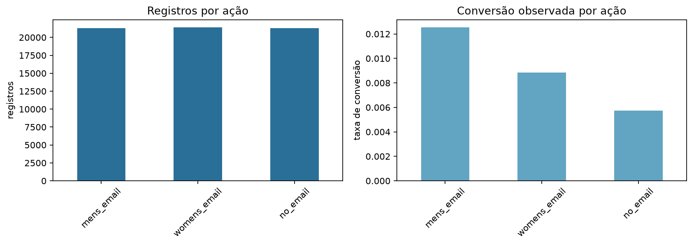
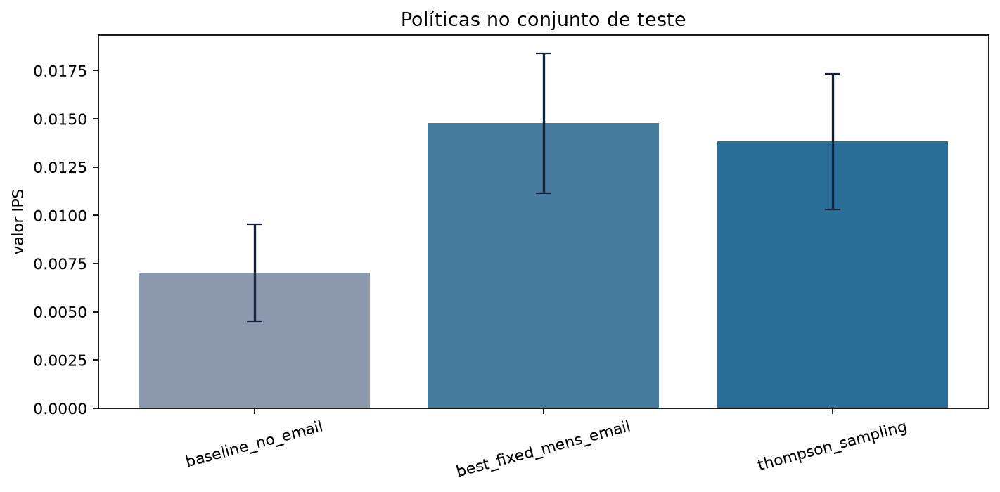
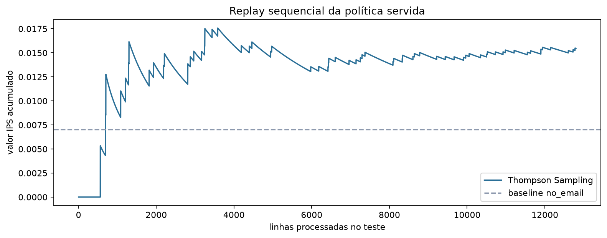

# Adaptive Offers Lab

Projeto final da Fase 5 do curso MLET. A solução implementa uma plataforma local de experimentação adaptativa que escolhe a próxima ação de campanha segundo o contexto disponível, registra a decisão e aprende com feedback binário.

O benchmark é o Hillstrom MineThatData E-Mail Analytics Challenge. O experimento original distribuiu clientes aleatoriamente entre campanha masculina, campanha feminina e ausência de campanha. Ele permite avaliar políticas adaptativas, mas não representa clientes de uma instituição financeira nem comprova desempenho em produtos bancários. O domínio financeiro é a aplicação de negócio proposta pelo Datathon.

## Problema de negócio e decisão

No cenário financeiro fictício, uma equipe de relacionamento precisa escolher a próxima comunicação para clientes previamente elegíveis: por exemplo, uma mensagem sobre planejamento financeiro, uma apresentação de produto já aprovado pela instituição ou nenhuma comunicação. Elegibilidade, consentimentos aplicáveis, restrições de contato e aprovação do conteúdo pertencem à área responsável antes de chamar a política. O algoritmo escolhe uma ação permitida e recebe depois uma resposta binária observada. Ele não aprova crédito, não define limites nem substitui análise humana.

O objetivo mensurável deste laboratório é maximizar conversão por oportunidade de contato, equilibrando o aprendizado sobre campanhas incertas e o uso das campanhas com melhor evidência. HTTP 200 confirma apenas que a requisição funcionou; não é conversão. No Hillstrom, recompensa `1` significa compra na janela de observação do experimento e `0` significa ausência de compra. Na interface, os botões simulam o retorno desse resultado, sem enviar mensagens reais.

O Hillstrom foi escolhido por registrar três ações randomizadas, incluindo o controle sem e-mail, e o resultado observado de cada cliente. Isso permite comparar políticas sem fabricar contrafactuais ou uma base sintética de conversões. A demonstração conserva as categorias originais de varejo; transformar seus nomes em produtos bancários não validaria uma aplicação financeira. Para uma aplicação real, novos dados e uma avaliação própria seriam necessários.

## Evidências da entrega

| Etapa | Evidência local |
| --- | --- |
| 0. Organização | `pyproject.toml`, `requirements.txt`, Docker e este README |
| 1. Base e EDA | `notebooks/01_eda.ipynb`, executado e com outputs salvos |
| 2. Preparação | `src/datathon/data.py` e `src/datathon/features.py` |
| 3. Baseline e adaptativo | `notebooks/02_baseline_vs_bandit.ipynb` e `scripts/run_experiment.py` |
| 4. Avaliação e Golden Set | `artifacts/experiment_summary.json` e `artifacts/golden_set.json` |
| 5. Serviço | FastAPI, interface em `/`, contrato em `/docs` e feedback persistente |
| 6. Nuvem | arquitetura conceitual abaixo e script opcional de Cloud Run |
| 7. MLOps | MLflow, Prometheus e Grafana no Docker Compose |
| 8. Apresentação | etapa externa deliberadamente adiada até a revisão final |

O código está disponível no [repositório público](https://github.com/jonathancavalcante77/tech-challenge-fase5). O vídeo será incluído após a gravação; `video.txt` ainda não faz parte do projeto.

## Dados e qualidade

Fonte: [Hillstrom no Kaggle](https://www.kaggle.com/datasets/bofulee/kevin-hillstrom-minethatdata-e-mailanalytics/data), versão 1, com licença Apache 2.0 conforme listada pelo uploader. Referência original: [MineThatData](https://blog.minethatdata.com/2008/03/minethatdata-e-mail-analytics-and-data.html). Fonte, checksum, target, ações e limitações estão versionados em `data/source.json`.

O CSV possui 64.000 registros e as colunas `recency`, `history_segment`, `history`, `mens`, `womens`, `zip_code`, `newbie`, `channel`, `segment`, `visit`, `conversion` e `spend`. O pipeline baixa por arquivo temporário, valida o SHA-256 antes de aceitar o arquivo e rejeita schema, ação ou domínio inválidos.

`segment` é a ação sorteada e não entra no contexto. `conversion` é o alvo principal. A política recebe feedback binário. A atribuição histórica é próxima de um terço por ação, permitindo replay e IPS sob a hipótese de atribuição uniforme. Os conjuntos são separados por ação em treino, validação e teste com semente `2026` e depois embaralhados independentemente com sementes `2026`, `2027` e `2028`. Nenhuma linha pertence a duas partições. A base não contém timestamp: a ordem simula chegadas randomizadas, sem alegação de validação temporal. Apenas dados anteriores à campanha são disponibilizados à política; `visit`, `conversion` e `spend` nunca entram nas features.



## Política e avaliação

O baseline fixo escolhido pelo projeto é `no_email`, o controle de não enviar comunicação. O professor exige uma regra fixa, sem determinar essa ação. A escolha mede ganho sobre ausência de campanha, não sobre toda estratégia de marketing; por isso a melhor ação fixa global, escolhida somente no treino, também é comparada. A política adaptativa é Thompson Sampling Beta-Bernoulli com prior `Beta(1, 1)` por segmento de recência (`recent`, `middle`, `old`) e afinidade histórica de categoria (`mens`, `womens`, `mixed`, `none`). Histórico, canal, região e condição de cliente novo são validados e registrados para contextualizar a demonstração, mas a versão atual não os utiliza na chave do posterior.

A política é inicializada no treino e selecionada na validação antes de calcular o resultado de teste. O teste é reservado ao relato, sem escolha de semente ou parâmetros por seu resultado. No replay sequencial, ela só aprende depois de recomendar e quando a ação recomendada coincide com a ação registrada. Cada contribuição é corrigida pela propensão uniforme de um terço: `valor IPS = média(3 × conversão × indicador de ação coincidente)`. A API chama o mesmo método estocástico `recommend` usado nessa avaliação. O snapshot servido contém exclusivamente o treino, com checksum, semente, protocolo e fingerprint vinculados ao resumo avaliado; o aprendizado do teste não é publicado.

| Política no teste | Valor IPS | IC 95% aproximado | Diferença contra `no_email` |
| --- | ---: | ---: | ---: |
| Baseline `no_email` | 0,007030 | [0,004517; 0,009543] | 0 |
| Melhor ação fixa `mens_email` | 0,014763 | [0,011127; 0,018400] | +0,007733 |
| Thompson Sampling | 0,015466 | [0,011744; 0,019188] | +0,008436 |

Thompson Sampling foi selecionado na validação (`0,009141` contra `0,005860` do controle). No teste, a conversão estimada foi **1,5466%**, contra **0,7030%** do controle e **1,4763%** da melhor ação fixa. O ganho pontual equivale a **0,8436 ponto percentual** contra o controle e **0,0703 ponto percentual** contra a melhor ação fixa. Os intervalos desta última e do bandit se sobrepõem; não há afirmação de superioridade estatística. A taxa de exploração observada foi `22,29%`, com 4.313 linhas casadas no teste. Essa taxa mede escolhas diferentes da maior média posterior, não um epsilon configurado.

O protocolo `stratified-shuffled-replay-v2` substitui a avaliação anterior, que recebia blocos ordenados por ação. Os números antigos não devem ser usados na apresentação. A correção manteve a semente `2026`, as partições, o algoritmo, os priors e os critérios de seleção; mudou a ordem de chegada dentro das partições.





## Golden Set

Os cinco perfis fictícios abaixo são entradas fixas, independentes dos dados usados no treino. Cada um tem segmento esperado e fundamento qualitativo definidos antes da inferência. O mesmo Thompson Sampling da API produz as respostas. A avaliação pode reprovar catálogo, segmento, suporte treinado, probabilidades e coerência da exploração; não atribui aprovação automática. Não se exige a mesma oferta em toda chamada estocástica. O JSON inclui contexto, médias, amostras, verificações e justificativa; o notebook mostra as entradas e as saídas completas. Esses são casos de recomendação, distintos dos testes unitários do código.

| Caso | Recência | Histórico US$ | mens / womens | Novo | Região | Canal |
| --- | ---: | ---: | --- | ---: | --- | --- |
| `recent_mens_web` | 2 | 420 | 1 / 0 | 0 | Urban | Web |
| `recent_womens_multichannel` | 3 | 610 | 0 / 1 | 0 | Surburban | Multichannel |
| `middle_mixed_web` | 5 | 780 | 1 / 1 | 0 | Urban | Web |
| `old_mens_phone` | 9 | 260 | 1 / 0 | 1 | Rural | Phone |
| `old_womens_web` | 11 | 330 | 0 / 1 | 1 | Urban | Web |

| Caso | Segmento | Recomendação | Faz sentido? | Justificativa resumida |
| --- | --- | --- | --- | --- |
| `recent_mens_web` | `recent:mens` | `mens_email` | Sim | Maior média posterior do segmento |
| `recent_womens_multichannel` | `recent:womens` | `mens_email` | Sim, com ressalva | Diferença posterior mínima para `womens_email`; a incerteza deve ser exposta |
| `middle_mixed_web` | `middle:mixed` | `mens_email` | Sim | Maior média posterior, com evidência segmentada limitada |
| `old_mens_phone` | `old:mens` | `mens_email` | Sim | Maior média posterior do segmento |
| `old_womens_web` | `old:womens` | `mens_email` | Sim, com ressalva | O rótulo descreve categoria de campanha, não gênero do cliente |

Essas decisões fazem sentido dentro do benchmark randomizado. Elas não autorizam decisão de crédito nem personalização com atributos sensíveis.

## Execução local

Requer Python 3.11 ou 3.12.

```powershell
python -m venv .venv
.\.venv\Scripts\Activate.ps1
python -m pip install --upgrade pip
pip install -e ".[dev]"
python scripts/run_experiment.py
python scripts/build_policy_snapshot.py
python scripts/build_golden_set.py
python scripts/execute_notebooks.py
python scripts/track_mlflow.py
ruff check .
ruff format --check .
pytest --cov=src --cov=app
```

Se `data/raw/hillstrom.csv` não existir, ele será baixado e validado. Dados brutos, bancos, estados mutáveis e volumes permanecem fora do Git. Resumo, Golden Set, figuras e outputs dos notebooks são evidências pequenas e versionáveis.

Para abrir a interface sem Docker, execute `uvicorn app.main:app --host 127.0.0.1 --port 8080`. Os notebooks também podem ser abertos no Jupyter: o início de cada um encontra a raiz do projeto tanto a partir da pasta raiz quanto de `notebooks/`. Para o MLflow nativo, use `mlflow server --backend-store-uri sqlite:///mlruns/mlflow.db --host 127.0.0.1 --port 5000` depois do registro local.

## API e persistência

O serviço oferece:

- `POST /recommend`: valida o contexto e retorna ação, segmento, versão, médias posteriores, amostras, exploração e identificador da decisão;
- `POST /feedback`: registra recompensa `0` ou `1` e atualiza a política em modo local;
- `GET /health`: saúde e ambiente;
- `GET /metadata`: versão, modo, regra de decisão e estado operacional;
- `GET /metrics`: métricas Prometheus;
- `/docs`: contrato OpenAPI;
- `/`: interface web para demonstração.

Na interface, o fluxo é perfil fictício → recomendação → comparação das três campanhas → resultado observado. Cinco perfis de referência reutilizam os contextos do Golden Set; a ação é sempre calculada pela API, não copiada das respostas salvas. Recência e compras anteriores nas categorias masculina e feminina definem o segmento da política. Histórico de valor, condição de cliente novo, canal e região são registrados, mas não influenciam a escolha nesta versão. A tela mostra os nomes em português, preservando os valores originais da base na requisição.

A apresentação prioriza a tarefa: o perfil ocupa uma coluna e a recomendação, a justificativa e as três estimativas ocupam a outra; no celular, o fluxo fica em sequência vertical. Os pontos da comparação compartilham uma escala, e a ação selecionada é indicada por texto e destaque discreto. Perfis de referência, campos que não influenciam a política e identificadores técnicos ficam disponíveis em seções recolhíveis. Há temas claro e escuro com alternância manual e preferência persistida no navegador. O formulário anuncia erros e carregamento; a resposta observada fica identificada após o registro.

As porcentagens da comparação são médias posteriores do segmento no estado atual da política, inicializado com o Hillstrom e atualizado por feedback local em modo `mutable`. Não são o valor IPS global do teste nem estimativas de desempenho bancário. O sorteio de Thompson Sampling pode selecionar uma campanha diferente da maior média ou da categoria comprada anteriormente; a explicação da tela deriva da resposta efetiva. Perfis sem segmento treinado não exibem recomendação antiga. O feedback de uma decisão pode ser registrado uma vez pela tela; em `readonly`, os controles ficam indisponíveis. Códigos de segmento e versão ficam recolhidos em “Dados técnicos da decisão”.

Exemplo:

```powershell
$body = @{
  recency = 3
  history = 350
  mens = 1
  womens = 0
  newbie = 0
  zip_code = "Urban"
  channel = "Web"
} | ConvertTo-Json

Invoke-RestMethod http://localhost:8080/recommend `
  -Method Post -ContentType "application/json" -Body $body
```

Uma instalação nova carrega `config/policy_snapshot.json`; ela nunca inicia silenciosamente com priors vazios. Em modo `mutable`, SQLite guarda decisões, feedback e o estado Bayesiano na mesma transação. `state/policy.json` é um espelho escrito de forma atômica. Na reinicialização, o SQLite prevalece, evitando perda de aprendizado se o espelho estiver ausente. Feedback repetido é idempotente e feedback contraditório é rejeitado.

`POLICY_MODE` aceita somente `mutable` e `readonly`. O modo somente leitura usa o snapshot treinado, não registra decisões e rejeita feedback. Nos dois modos, um perfil sem segmento presente na política é rejeitado com HTTP 422 antes da amostragem ou do registro de decisão. No snapshot deste benchmark, isso inclui `mens=0` e `womens=0`: não há observações de treino para essa combinação. A API não cria um posterior sem evidência para atender esses perfis.

Cada operação SQLite fecha sua conexão explicitamente após commit ou rollback. Uma falha ao persistir o novo estado da política também desfaz o feedback, preservando a consistência entre o histórico e o aprendizado.

## Docker, MLflow e observabilidade

Com o Docker Desktop ativo:

```powershell
docker compose up --build
```

As portas podem ser substituídas por `API_PORT`, `MLFLOW_PORT`, `PROMETHEUS_PORT` e `GRAFANA_PORT`. Isso permite manter outros projetos locais em execução; por exemplo, `$env:API_PORT=8081` publica a API em `8081` sem alterar a porta interna do container.

Acesse:

- aplicação: `http://localhost:8080`;
- OpenAPI: `http://localhost:8080/docs`;
- MLflow: `http://localhost:5000`.

O serviço `tracker` registra automaticamente `artifacts/experiment_summary.json` no servidor MLflow do Compose. A chave é o SHA-256 do conteúdo completo e canônico do resumo. Só uma run `FINISHED` com a mesma evidência evita duplicação; métricas, parâmetros ou protocolo alterados geram uma nova run. Execuções anteriores são preservadas como histórico. Parâmetros, métricas e o JSON estão disponíveis na interface do MLflow.

Para subir também as melhorias opcionais:

```powershell
docker compose --profile monitoring up --build
```

Prometheus fica em `http://localhost:9090` e Grafana em `http://localhost:3000`. No primeiro acesso local ao Grafana, use `admin` como usuário e senha e defina a nova senha solicitada. O dashboard `Adaptive Offers` é provisionado automaticamente e mostra taxa de requisições, p95 de latência, recomendações por ação e exploração. A API também expõe contadores de feedback e quantidade de segmentos da política.

## Arquitetura de nuvem

Em uma arquitetura AWS, dados e artefatos poderiam ficar em S3; um job prepararia as features; DynamoDB ou Aurora substituiria o SQLite; ECR armazenaria a imagem; ECS/Fargate serviria a API; e CloudWatch acompanharia latência, erros, exploração e drift. IAM separaria permissões e os logs não conteriam dados pessoais. Nenhum recurso AWS é necessário para executar esta entrega.

Como extensão pronta para uso futuro, `scripts/deploy-cloud-run.ps1` constrói a mesma imagem, envia ao Artifact Registry e publica no Cloud Run em modo `readonly`. O serviço usa o snapshot treinado incluído na imagem, grava apenas banco temporário em `/tmp`, limita a uma instância e não depende do filesystem efêmero para aprendizado. A implantação real foi deliberadamente adiada até a revisão local final.

## Governança, privacidade e limitações

Esta entrega usa um benchmark público sem identificadores pessoais. Em uma aplicação financeira hipotética que tratasse dados pessoais para personalização de comunicação, a base legal considerada seria o legítimo interesse previsto nos arts. 7º, IX, e 10 da [LGPD](https://www.planalto.gov.br/ccivil_03/_ato2015-2018/2018/lei/l13709compilado.htm), condicionado a avaliação documentada de balanceamento, expectativa do titular, necessidade, transparência e possibilidade de oposição. Se essa avaliação não sustentasse o tratamento, outra base legal válida, como consentimento específico, precisaria ser definida antes do uso.

A finalidade seria exclusivamente selecionar comunicação comercial. Seriam coletados somente atributos necessários, com retenção limitada, controle de acesso, auditoria e eliminação ao fim da finalidade. A recomendação não produz aprovação, recusa, preço ou limite de crédito. Mudanças de política, campanhas sensíveis e impactos relevantes exigiriam revisão humana. O titular teria canal para informação, contestação e exercício dos direitos aplicáveis.

Neste laboratório, `mens` e `womens` são indicadores de compras em categorias de varejo, não gênero; `history` é gasto passado em compras, não renda ou patrimônio. `zip_code` contém apenas Urban/Surburban/Rural, sem CEP individual. A API rejeita campos extras, inclusive nome e identificadores. A decisão usa recência e afinidade; demais atributos históricos permanecem para inspeção do cenário. Uma implantação real deve reavaliar essa necessidade e eliminar campos que não contribuam para sua finalidade.

| Registro | Finalidade | Retenção e descarte |
| --- | --- | --- |
| CSV público, resumo, snapshot e Golden Set fictício | Reproduzir e avaliar o experimento | Manter durante a avaliação acadêmica; dados brutos ficam fora do Git e podem ser removidos após a avaliação, mantendo referência/checksum |
| UUID da decisão, contexto fictício, ação, versão, horário e recompensa em SQLite | Auditar a demonstração e aplicar feedback uma única vez | Manter até o encerramento da avaliação ou reinicialização deliberada do laboratório; não usar dados reais |
| Métricas agregadas e histórico MLflow | Observar o serviço e comparar experimentos | Manter como evidência local da avaliação; sem identificador do cliente em labels de métricas |

O responsável pela demonstração revisa o descarte ao encerrá-la. Para uma instalação Docker descartável, `docker compose --profile monitoring down --volumes` elimina os volumes locais, inclusive decisões, MLflow e Grafana; portanto, só deve ser usado quando essas evidências puderem ser descartadas. Isso não apaga o CSV no host nem os artefatos versionados. Na execução nativa, a aplicação deve estar parada antes de remover o banco, arquivos WAL/SHM e o espelho JSON de `state/`. Não há expurgo automático nem tratamento de titulares reais implementado; para uma operação financeira, prazo, base legal e atendimento ao titular precisam ser definidos e implementados antes do uso.

Limitações principais:

- benchmark de varejo de 2008, sem dados bancários;
- ausência de contrafactuais individuais;
- IPS depende da propensão histórica conhecida;
- intervalos apresentados são aproximações descritivas;
- segmentação deliberadamente simples;
- recomendação estocástica pode variar conforme o estado do gerador;
- desempenho offline não garante resultado em produção.

## Qualidade

O projeto usa layout `src`, validação Pydantic, estado versionado, checksum, SQLite em WAL, escrita atômica, usuário não privilegiado no container e testes unitários e de integração. A suíte cobre API, políticas, replay, persistência, concorrência, recuperação, checksum, configuração e Golden Set.

A revisão local de 29/09/2026 aprovou 75 testes com 93% de cobertura, além de Ruff, sintaxe JavaScript, validação do Docker Compose e fluxos de interface no Chromium em desktop e celular. A revisão visual usou Playwright CLI, capturas de 1440 e 390 pixels, tema claro e escuro e uma segunda passada para reduzir o peso do título e melhorar contraste e leitura. Uma cópia limpa dos arquivos candidatos, com ambiente Python novo e volumes Docker novos, reproduziu o resumo, o snapshot e o Golden Set e executou os dois notebooks sem erros em 28/09/2026. O código está publicado no GitHub com acesso público. A gravação do pitch e a inclusão do link real em `video.txt` ficam para uma etapa posterior.

## Conferência com a aula de orientação

A transcrição da aula de 27/07/2026 foi usada para conferir as orientações do professor. As dicas derivadas por outra ferramenta foram tratadas como interpretação, sem substituir a transcrição ou o enunciado. A numeração oficial é de 0 a 8, totalizando nove etapas; a menção oral a oito etapas não fundamenta um cálculo de nota neste projeto.

| Orientação da aula | Evidência e decisão |
| --- | --- |
| [08:19] Problema de oferta/mensagem adaptativa | Cenário financeiro, elegibilidade externa, recompensa e limites explicados acima |
| [11:37] Finalidade, minimização, retenção e humano no processo | Seção de governança com campos, critérios de descarte e limites reais |
| [11:58–12:33] Outra base aceita se justificada | Kaggle Hillstrom, ações randomizadas, conversão observada e limites de varejo |
| [19:10–21:05] EDA, tratamento e alvo pronto | Notebook 01 executado; nenhuma geração de recompensa sintética |
| [21:23–22:14] Regra fixa e algoritmo adaptativo comparados | Notebook 02, controle escolhido e melhor ação histórica adicional |
| [22:36–23:16] Cinco payloads e recomendações coerentes | Golden Set com entradas, resultados, critérios verificáveis e discussão |
| [23:33–24:16] Fluxo demonstrável | Interface FastAPI: contexto → recomendação → feedback simulado |
| [24:33–25:11] Nuvem livre, um ou dois parágrafos | Arquitetura conceitual e script GCP opcional; deploy não exigido |
| [25:32–26:09] MLflow local com parâmetros e métricas | Registro reproduzível do resumo e histórico de versões |
| [14:35] Repositório público; [26:09–26:52] vídeo até 5 minutos | Repositório público disponível; vídeo pendente |

A parte local atende às evidências descritas nesta conferência. A entrega acadêmica completa ainda depende do vídeo com problema, modelo e demonstração. Prometheus, Grafana, Docker e os testes de software são melhorias adicionais; a aula não os torna substitutos dos entregáveis obrigatórios.
